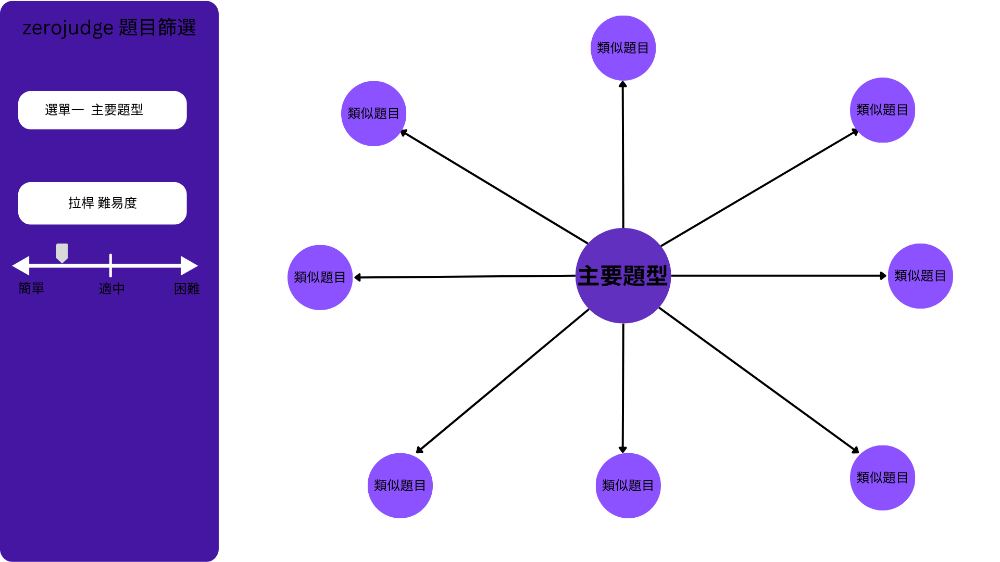
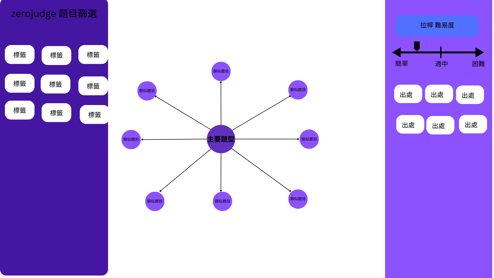

# zerojudge_dashboard

# 資料收集與分析
## 取得題目列表
- 使用JavaScript對題目列表頁面(https://zerojudge.tw/UserStatistic)
```js
const linksText = Array.from(document.querySelectorAll('a'))
  .map(a => a.textContent.trim());

// 把內容轉成文字（每行一個）
const content = linksText.join('\n');

// 建立 Blob
const blob = new Blob([content], { type: 'text/plain' });

// 建立下載連結
const a = document.createElement('a');
a.href = URL.createObjectURL(blob);
a.download = 'links.txt';

// 觸發下載
a.click();

// 釋放記憶體
URL.revokeObjectURL(a.href);
```
## 取得題目資訊 [程式](ZJcrawler.py)
-標題、標籤、通過比率、出處(作者)


## 題庫內容統計分析 [程式](analysis.py)

# 網頁設計
## 雛形設計


## AI 提示詞
```css
製作 zerojudge 題庫檢索的網頁。使用純 html/js/css 設計純前端的網頁，使用專業科技風格設計。

網頁分三欄式設計：左側欄 / 中間欄 / 右側欄

左側欄可以切換[標籤]/[出處]兩個分頁
每個分頁依照 json 分析出的次數列出所有標籤與內容項目。當項目被點擊。點擊該標籤（或來源）所屬的題目清單，會使用來更新中間欄與右側欄。

中間欄內容為標籤的關聯地圖。由左側選擇的標籤項目所產生題目清單所包含的所有標籤將呈現在中間的關聯地圖中。每個節點代表一個標籤，當某兩個標籤共同出現在一個題目中，標籤之間的線段權重會增加。點擊中間欄位的每個標籤，可以針對已經篩選出的題目清單，再做進一步過濾，也就是右側欄需要再過濾包含中間欄點選的標籤。

右側欄內容為題目清單，需要列表出由左側欄與中間欄篩選出的所有問題清單，清單表格要包含問題Id、標題、標籤、出處、連結與通過人數。在右側欄上方有拉桿可以針對通過人數再進行題目過濾。

```
## 功能
- 題目分類(標籤、品質(作者)、通過率)
- 相關標籤
- 表單回饋
